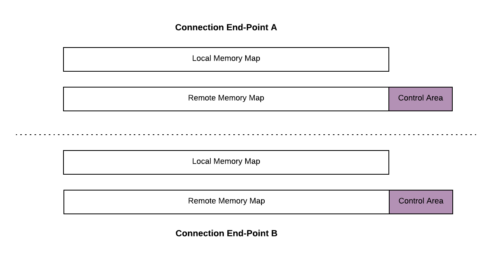
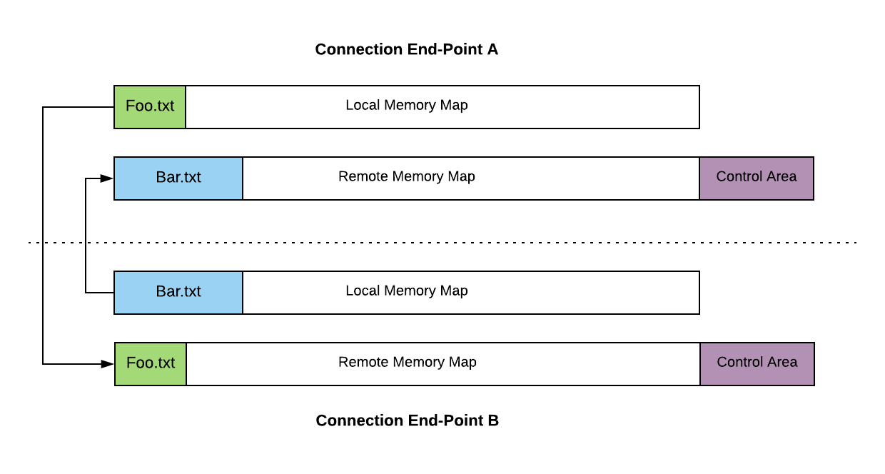

# The RemoteFile Protocol

Communication between APX clients and servers is built on top of a lower-level, transport-agnostic protocol called **RemoteFile**.

While APX presents a high-level model of nodes, provide ports, and require ports, RemoteFile provides the underlying mechanism that mirrors data across network and process boundaries in real time.

```{note}
For full binary packet layouts, command opcodes, and wire framing, see the [RemoteFile v1.0 Specification](../specifications/protocols/remotefile.md).
```

## Why Memory-Mapped Synchronization?

Most distributed systems rely on either remote procedure calls (RPC) or message queues. In automotive and real-time embedded environments, these models introduce overhead:

- **RPC models** require request-response round trips and dynamic marshalling/unmarshalling on both sides.
- **Message queue models** typically allocate dynamic buffers per message and send complete signal packets on every update.

RemoteFile takes a different approach: **continuous memory synchronization**. Each endpoint treats the connection as a shared, virtual memory space. When a node updates a signal:

1. The new value is written to a deterministic offset in the local memory map.
2. A delta write message containing only the modified byte range is sent over the wire.
3. The receiving endpoint writes those bytes directly into its mirrored memory map at the same offset.

This makes communication inherently asynchronous, bidirectional, and lightweight.


## The Virtual Memory Abstraction

Every RemoteFile connection maintains two 1GB virtual memory spaces:

- **Local Memory Map**: Contains files and signal buffers created and published by the local endpoint.
- **Remote Memory Map**: Contains files and signal buffers published by the remote peer, plus a dedicated **Control Area**.



### Sparse Virtual Memory on Embedded Devices

The 1GB address space is purely virtual addressing. Small microcontrollers and embedded targets do not need 1GB of physical RAM:

- Endpoints only allocate physical RAM for the specific files they create or open (typically a few hundred bytes to several kilobytes per APX session).
- Unused addresses between files remain empty virtual space and consume zero physical memory.

This allows APX to use fixed, 32-bit address spaces with predictable offsets across all device types—from 8-bit microcontrollers to 64-bit multi-core processors.

## Files as Named Memory Regions

In RemoteFile, a **file** is defined as a contiguous, named byte array mapped to a specific start address and size within the virtual memory space.

This definition is independent of traditional filesystem files. In an APX session, files represent two core artifacts:

1. **Definition Files (`.apx`)**: The text-based APX IDL interface description for a node.
2. **Signal Data Buffers (`.out` / `.in`)**: The packed binary memory regions where live port values are read and written.

### The Control Area

In addition to user files, the Remote Memory Map reserves the final 1KB (1,024 bytes) at the very top of the 1GB address space (`0x3FFFFC00`–`0x3FFFFFFF`) as a dedicated **Control Area**.

The Control Area acts as a mailbox for control-plane commands. Rather than writing signal data, an endpoint writes structured command packets to this fixed address to:

- Announce newly published files.
- Request opening or closing remote files.
- Revoke unneeded files.
- Send heartbeat and ping diagnostics.

Because the Control Area exists at a fixed, known address from the moment a connection is established, peers can exchange commands before any data files are opened.

### Memory Address Layout

To minimize protocol overhead:

- **Low Address Range (`0`–`16,383`)**: Frequently updated signal data buffers are mapped to the first 16KB to enable compact 2-byte address headers.
- **High Address Range (`16,384`–`0x3FFFFBFF`)**: Static or rarely updated files (such as `.apx` definition files) are mapped across the remaining address space using 4-byte address headers.
- **Control Area (`0x3FFFFC00`–`0x3FFFFFFF`)**: The final 1KB reserved exclusively for control commands.

## Lifecycle and Synchronization

The synchronization lifecycle consists of four main phases:

1. **File Announcement**: The publishing endpoint sends a file announcement command to the remote peer's Control Area, declaring the file name, size, start address, and checksum.
2. **File Open**: The receiving endpoint evaluates whether it needs the file and has sufficient memory to host it. If accepted, it issues a file open command to the Control Area.
3. **Initial Synchronization**: Once opened, the publisher transmits the complete initial contents of the file in a single write.
4. **Delta Updates**: For the remainder of the session, whenever local file data changes, the publisher issues small write operations targeting only the modified byte ranges.



## Next Steps

- Learn how an entire connection is negotiated and initialized in [APX Session](session.md).
- Read the normative wire protocol and command definitions in the [RemoteFile v1.0 Specification](../specifications/protocols/remotefile.md).